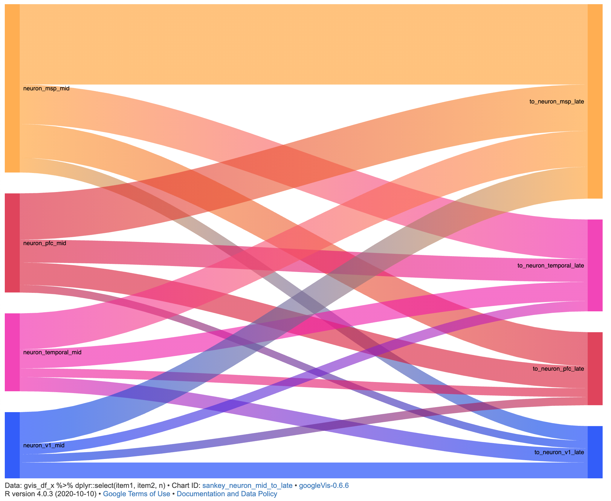

## Neuron early -> neuron mid -> neuron late
2020-12-26

```{r}
p_load(here)

load("sankey_plots_workspaceImage.RData")
```

```{r fig.width=10}
sankey_counts_neuron <- 
  sankey_counts %>% 
    dfilter(item1 %>% str_detect('neuron') & 
            item2 %>% str_detect('neuron')) %>% 
      dplyr::select(item1, item2, n, n_norm, genes)

# Make each vector of genes into a single string w/ genes separated by ';' to write out to file.
# [Bioconductor Forum](https://support.bioconductor.org/p/83911/)
sankey_counts_neuron$genes %<>% unstrsplit(sep = ';')

out_dir <- "~/Dropbox/ARK_lab/second-trimester/2nd Trimester Areas Paper/analysis/neocortex/sankey_plots"

write_tsv(sankey_counts_neuron, "../out/split_by_stage/within_celltype_across_stages/sankey_counts_neuron.tsv")

sankey_counts_neuron_e2m <- sankey_counts %>% dfilter(str_detect(item1, 'neuron_.*_early') & 
                                                        str_detect(item2, 'neuron_.*_mid'))

make_gvisSankey(chart_id = 'neuron_early_to_mid', gvis_df_x = sankey_counts_neuron_e2m)

sankey_counts_neuron_m2l <- sankey_counts %>% dfilter(item1 %>% str_detect('neuron_.*_mid') & 
                                                        item2 %>% str_detect('neuron_.*_late'))

make_gvisSankey(chart_id = 'neuron_mid_to_late', gvis_df_x = sankey_counts_neuron_m2l)

# TODO [HERE] 2020-12-26 @ 19:07 Need to reorder factors so that regions are plotted correctly.
```

Resulting plot:

{width="428"}
{width="431"}

## Radial glia early -> mid -> late
2021-03-12
```{r}
sk_counts_rg_e2m <- sankey_counts %>% dfilter(str_detect(item1, 'rg_.*_early') & 
                                              str_detect(item2, 'rg_.*_mid'))

make_gvisSankey(chart_id = 'radialglia_early_to_mid', gvis_df_x = sk_counts_rg_e2m)
```

## Save sankey internsecion counts and genes between all radial glia, neuron and IPC groups.
```{r}
# Use `sankey_counts`. I think `pairs` includes DE genes from all stages
sankey_counts_tmp <- sankey_counts %>% 
  dplyr::rename(celltype_target = cell_targetpe_target) %>%
  arrange(celltype_source, stage_source, region_source, 
          celltype_target, stage_target, region_target) %>%
   dplyr::select(item1, item2, n, genes) %>%
    mutate(genes = unstrsplit(genes, sep = ';'))

out_dir <- '~/Dropbox/ARK/2nd Trimester Areas Paper/analysis/neocortex/sankey'
write_tsv(sankey_counts_tmp, file.path(out_dir, 'sankey_counts_rg_ipc_neuron_by_stages.tsv'))
```


From @sankey_plots.Rmd `{r 2020-10-21_normalizePairCounts}`

```{r}
sankey_counts <- read_rds("../out_intermediate/sankey_markers_pairs_exnLineage.rds")
sankey_counts_neuron_e2m %>% select(item1, item2, n, n_norm, genes)

# Some genes are not shared with any item2. 
# DE genes of a given item1 total ? 

# # A tibble: 16 x 5
# # Groups:   item1 [4]
#    item1                 item2                   n n_norm genes       
#    <chr>                 <chr>               <dbl>  <dbl> <named list>
#  1 neuron_msp_early      neuron_msp_mid        165  0.450 <chr [165]> 
#  2 neuron_msp_early      neuron_pfc_mid        134  0.365 <chr [134]> 
#  3 neuron_msp_early      neuron_v1_mid          84  0.229 <chr [84]>  
#  4 neuron_msp_early      neuron_temporal_mid    56  0.153 <chr [56]>  
#  5 neuron_pfc_early      neuron_pfc_mid         87  0.236 <chr [87]>  
#  6 neuron_pfc_early      neuron_msp_mid         85  0.230 <chr [85]>  
#  7 neuron_pfc_early      neuron_temporal_mid    55  0.149 <chr [55]>  
#  8 neuron_pfc_early      neuron_v1_mid          38  0.103 <chr [38]>  
#  9 neuron_temporal_early neuron_msp_mid         92  0.630 <chr [92]>  
# 10 neuron_temporal_early neuron_temporal_mid    61  0.418 <chr [61]>  
# 11 neuron_temporal_early neuron_pfc_mid         50  0.342 <chr [50]>  
# 12 neuron_temporal_early neuron_v1_mid          42  0.288 <chr [42]>  
# 13 neuron_v1_early       neuron_msp_mid         95  0.477 <chr [95]>  
# 14 neuron_v1_early       neuron_v1_mid          89  0.447 <chr [89]>  
# 15 neuron_v1_early       neuron_temporal_mid    81  0.407 <chr [81]>  
# 16 neuron_v1_early       neuron_pfc_mid         46  0.231 <chr [46]> 


```

```{r}
colors.area
```

Split `givis.df` into stages.

```{r split_givsdf_stages}

stages <- levels(gvis.df$df[[1]]$stage.source)
# early #mid #late
gvis.df %<>% rename(comparison = 'item1_item2')
gvis.df_split_stage <- map2(.x = gvis.df$df,
                            .y = gvis.df$comparison,
                            .f = function(df = .x, comparison = .y, stage = stages) {
                                      map(.x = stage,
                                          .f = ~ dfilter(df,
                                                        stage.source == .x & stage.target == .x)
                                          ) %>% tibble(comparison = comparison, 
                                                           stage = stages, 
                                                           split_df = .)
                               })                 
     
gvis.df_split_stage %<>% purrr::reduce(rbind)
```

```{r}
p_load(googleVis)
p_load(glue)

path <- "~/cse-phd/second-trimester/neocortex/markers_area_celltype/sankey_plots/out/split_by_stage/sankey_"

# - comparison
#- stage
# - df 

# # A tibble: 9 x 3
#   comparison    stage split_df          
#   <chr>         <chr> <list>            
# 1 rg_to_neuron  early <tibble [16 × 13]>
# 2 rg_to_neuron  mid   <tibble [16 × 13]>
# 3 rg_to_neuron  late  <tibble [16 × 13]>
# 4 rg_to_ipc     early <tibble [16 × 13]>
# 5 rg_to_ipc     mid   <tibble [16 × 13]>
# 6 rg_to_ipc     late  <tibble [12 × 13]>
# 7 ipc_to_neuron early <tibble [16 × 13]>
# 8 ipc_to_neuron mid   <tibble [16 × 13]>
# 9 ipc_to_neuron late  <tibble [11 × 13]>

sankey_inter_celltype_split_stage <- pmap(gvis.df_split_stage,
                                          .f = ~ make_gvisSankey(chart_id = paste(..1, ..2, sep = "_"), 
                                                                 gvis_df_x = ungroup(..3)
                                                                 ))

# gvis.df_split_stage$sankey_plot <- sankey_inter_celltype_split_stage %>% map(~ .[[4]])


# sankey_inter_celltype_split_stage[[1]][[1]] %>% 
# purrr::flatten() %>% map() map(~ .$chart_id[1]) %>% 
# print(tag = "chart", file = glue(path, chart_id, ".html"))
  
sankey_inter_celltype_split_stage %>% map_depth(~ print(.$chart_id[[4]], tag = "chart",
                                                        file = glue(path, chart_id, ".html"),
                                                  ), 
                                                .depth = 2)
```
